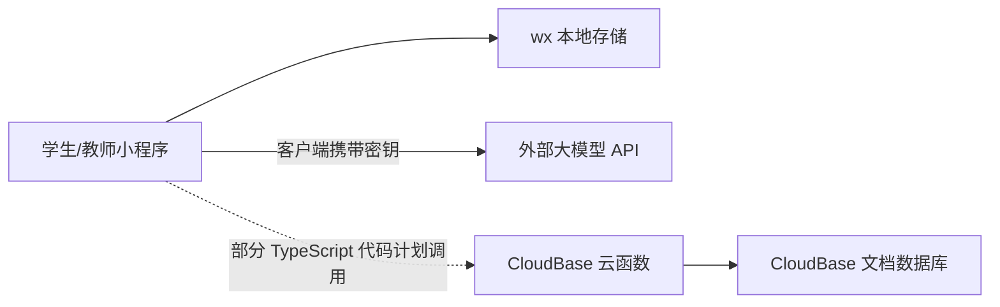

# 01. 现状审计

## 1. 审计范围与限制

本次审计覆盖：

- `miniprogram/` 页面、样式、配置和运行脚本；
- `cloudfunctions/` 中 `init`、`login`、`getReport`、`submitReport`；
- 根目录依赖、TypeScript 配置和公共工具；
- 页面注册、跳转目标、资源引用、本地存储和外部网络调用；
- 当前 Git 工作区，不改动用户已有源码。

未覆盖真实云环境配置、数据库权限规则、已部署函数版本、微信后台域名白名单、模型账户状态和真机兼容性。因此本报告是代码静态审计，不等同于渗透测试或生产验收。

## 2. 当前项目画像

### 2.1 已有功能

| 角色 | 已有页面/能力 | 当前数据来源 |
| --- | --- | --- |
| 学生 | 登录、自由问答、快捷问题、生成报告、历史记录、题目列表、题目详情多轮回答 | 大部分为本地存储和硬编码数据；AI 由客户端直接请求 |
| 教师 | 报告列表、报告详情、评分反馈、问题列表、新增/编辑/发布/拒绝 | 当前 JavaScript 主要使用本地存储 |
| 云端 | 初始化集合、登录注册、报告查询、报告提交/批阅 | 代码存在，但与当前页面 JavaScript 未形成一致链路 |

### 2.2 当前架构



这实际上是两套并存系统：当前 JavaScript 更接近“纯本地 Demo”，TypeScript 与云函数则表达了另一套“云端版意图”。两套代码的数据主键、路由和身份模型并不一致。

## 3. 主要发现

### 3.1 P0：上线阻断项

| 问题 | 代码证据 | 影响 | 处理建议 |
| --- | --- | --- | --- |
| AI 凭证写在客户端 | `student/chat/chat.js`、`student/question-detail/question-detail.js` | 小程序包可被提取，导致盗用、费用损失和数据泄露 | 立即在供应商控制台轮换；所有模型调用迁移到服务端 |
| 身份和角色可伪造 | 云函数直接使用 `event.openid`、`event.role`；登录允许用户自选教师 | 任意用户可冒充教师、读取或修改报告 | 从服务端微信上下文取用户 ID；角色只从数据库读取；教师由管理员授予 |
| JavaScript 与 TypeScript 分叉 | 登录 JS 为模拟登录，TS 调云函数；报告/教师页面也存在两套逻辑 | 修改源码不一定改变运行行为，构建结果不可预测 | 选择 TypeScript 为唯一源码，删除手写生成物并加入构建校验 |
| 医疗输出无安全边界 | 系统提示声称提供“准确、专业”的医学知识，无紧急分诊、拒答和人工升级 | 可能对生命健康造成误导 | 将产品限定为教育辅助，加入高风险识别、免责声明、紧急提示和医学审核 |
| 敏感数据无合规流程 | 对话可能包含医疗健康信息，当前本地/云端均无同意、删除、保留期 | 隐私与合规风险 | 完成数据清单、单独同意、最小化、加密、删除/导出和影响评估 |

### 3.2 P1：核心业务不可用或不一致

1. **登录链路不一致**：`login.js` 生成时间戳形式的模拟 openid，`login.ts` 调 `login` 云函数；教师登录跳转目标也不同。
2. **云函数登录实现可疑**：在云函数内再次用客户端 `code` 换 session，而 CloudBase 小程序函数本应优先使用可信调用上下文；还未验证当前 `wx-server-sdk` 是否支持现有写法。
3. **报告主键错位**：云数据库文档主键为 `_id`，页面多处把 `conversationId` 当作 `reportId`，而 `getReport` 使用 `.doc(reportId)` 查询。
4. **评分 0 无法提交**：云函数条件为 `teacherScore` 真值判断，合法的 0 分会被判为参数错误。
5. **报告状态并发不安全**：批阅更新没有版本号/事务/条件更新，重复提交或多教师同时批阅会互相覆盖。
6. **历史记录重复**：每次 AI 回复都 `unshift` 一条完整会话快照，没有按 `conversationId` 更新，会生成多个重复会话。
7. **本地存储是事实数据源**：跨设备、清缓存、换账号后数据丢失；同一设备切换账号还可能串数据。
8. **题库链路未打通**：教师问题存储在 `problems`，学生问题列表却是硬编码数组，发布后学生不可见。
9. **题目状态未闭环**：学生提交回答后不创建 submission，也不更新“未回答/已回答”。
10. **AI 上下文不一致**：自由问答只把当前一句发送给模型；题目详情才发送完整历史。

### 3.3 P1：页面与资源缺陷

- 教师问题组件使用 `Component(...)`，但 `problem.json` 未声明 `"component": true`。
- `problem.wxml` 引用 `/resource/添加.png`、`/resource/刷新.png`，仓库中不存在这两个文件。
- 代码跳转到 `teacher/problem-detail` 和 `teacher/problem-stats`，页面不存在且未在 `app.json` 注册。
- `teacher/list` 同时被当作页面注册、又被当作组件使用，职责混乱。
- `question` 页面缺少页面 JSON（虽可使用默认配置，但与项目其余页面不一致）。
- 根目录和 `miniprogram/resource` 存在内容完全相同的两套图片，根目录版本不会随小程序根正常使用，增加维护混乱。
- `index.wxml` 仍是模板欢迎页，但 `index` 的逻辑会立刻重定向，属于死代码。

### 3.4 P1：工程化缺口

- `npm run build -- --noEmit` 当前失败：本地未安装 `tsc`；仓库没有 lockfile，无法 `npm ci` 可重复安装。
- 没有 README、环境模板、Lint/格式化、测试、CI、数据库迁移、部署脚本和版本策略。
- `tsconfig.json` 包含根目录全部 TypeScript，但公共 `utils/` 位于 `miniprogramRoot` 外，打包边界不清晰。
- 多个云函数重复依赖和初始化代码，没有共享校验、鉴权、日志、错误处理和配置层。
- 错误响应把 `error.message` 直接返回客户端，可能泄露内部信息。
- 固定环境 ID 写在 `app.ts/app.js`，并与根目录常量中的另一环境 ID 不一致。
- 开发配置关闭了 URL 校验；生产发布流程没有防止误用开发配置。

### 3.5 P2：体验与可维护性缺口

- 学生发送、报告生成、教师提交均缺少幂等键和重复点击防护。
- 无分页游标、搜索、筛选、空态重试、离线提示和请求取消。
- 大量页面内联业务逻辑，没有 API 服务层、类型模型和统一错误码。
- 没有班级、课程、学期、教师—学生关系；“指定班级/指定学生”只是 UI 选项。
- 没有管理员端、教师认证、内容审核人或医学专家复核角色。
- 没有题目版本、评分量表、作答次数、截止时间、发布撤回、归档和统计口径。
- AI 结果没有引用、证据等级、模型版本、提示词版本和生成时间，报告不可追溯。

## 4. 数据与权限风险示例

当前云函数把客户端字段当作事实：

```text
客户端 event.role = teacher
        ↓
getReport 查询全部待批阅报告
        ↓
submitReport 可写任意 reportId
```

正确方式应为：

```text
微信可信调用上下文 → openid
        ↓
users/role_bindings 查询已审核角色
        ↓
校验资源归属、班级关系和操作权限
        ↓
事务或带版本号更新 + audit_logs
```

## 5. 成熟度评估

| 维度 | 当前等级（5 分） | 说明 | 目标 |
| --- | ---: | --- | ---: |
| 产品流程 | 2 | 页面雏形较全，闭环未连通 | 4 |
| 架构 | 1 | 本地 Demo 与云端意图并存 | 4 |
| 安全 | 0 | 密钥和身份模型存在阻断风险 | 4 |
| 数据治理 | 1 | 有初始集合，无统一模型/迁移/保留策略 | 4 |
| AI 工程 | 1 | 能调用模型，无网关、安全和评测 | 4 |
| 测试质量 | 0 | 无测试、无可重复构建 | 4 |
| 运维观测 | 0 | 无环境治理、指标、告警、备份演练 | 4 |

## 6. 可复用资产

不需要推倒重来，以下资产可以保留：

- 学生聊天、历史、报告、教师列表/详情的 WXML/WXSS 视觉结构；
- 角色与报告状态的基本业务概念；
- CloudBase 项目结构和 4 个云函数的业务意图；
- 问题类型“医学常识/模拟诊疗/病例分析”；
- 报告包含消息、AI 分析、教师评分和反馈的产品方向。

复用时应把 UI 与业务逻辑解耦，并按新数据模型重新接线。

## 7. 审计结论

当前版本适合做交互展示，不适合作为真实教学或医疗相关服务发布。完善工作的第一阶段必须是“收口与打底”：撤销密钥、统一源码、建立可信身份和云端数据闭环。继续增加页面而不先解决这些问题，会扩大返工面积。
