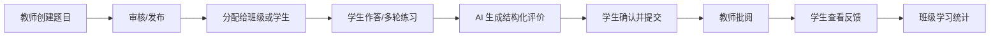

# 02. 产品需求与边界

## 1. 产品定位

产品定位为：**面向医学教学场景的 AI 辅助问答与形成性评价工具**。

它帮助学生练习医学知识、模拟问诊和病例分析，帮助教师发布题目、查看学习过程、批阅报告和了解共性薄弱点。它不应被描述为面向患者的诊断、处方、急救或远程医疗服务。

### 1.1 明确不做

- 不向用户下诊断结论、开具处方或替代线下医疗；
- 不根据真实患者信息自动做高风险临床决策；
- 不允许未审核用户自选成为教师；
- 不把用户对话默认用于训练第三方模型；
- 不在 MVP 中建设复杂教务系统、支付、社交或公开内容社区；
- 不承诺 AI 内容“绝对准确”。

## 2. 用户与角色

| 角色 | 主要职责 | 授权方式 |
| --- | --- | --- |
| 学生 | 查看被分配的题目、作答、AI 练习、生成报告、查看教师反馈 | 微信登录后加入班级/课程 |
| 教师 | 创建题目、发布作业、查看本班提交、批阅、查看统计 | 管理员邀请或人工审核，不允许自选 |
| 医学审核员 | 维护知识来源、安全规则、抽检 AI 输出和题目 | 管理后台授予 |
| 管理员 | 组织、班级、角色、配置、审计、模型策略和数据请求 | 最小权限后台账号 + MFA |

同一用户可拥有多个角色，但每次操作都必须按当前组织和课程上下文授权。

## 3. MVP 核心闭环

### 3.1 学生端用户故事

- 作为学生，我可以看到只分配给我或我所在班级、且已发布未过期的题目。
- 我可以按题目类型进行单轮回答或模拟诊疗多轮对话。
- 我可以中断后继续未完成的作答，不会产生重复历史记录。
- 在提交前，我能看到 AI 内容标识、适用边界和隐私提示。
- 结束练习后，我可以得到结构化报告：量表维度、依据、改进建议、引用和不确定性。
- 我可以把报告提交给教师，并看到待批阅/已批阅/退回修改状态。
- 我可以查看、导出或按规则申请删除自己的数据。

### 3.2 教师端用户故事

- 作为教师，我只能管理自己组织/课程/班级范围内的数据。
- 我可以创建题目草稿，选择类型、难度、评分量表、知识点、截止时间和发布对象。
- 我可以预览题目和 AI 教学提示，提交审核后发布。
- 我可以看到提交进度、待批阅列表并按班级/题目/状态筛选。
- 我可以在 AI 建议基础上独立评分、写反馈、退回修改或完成批阅。
- 我可以看到评分版本和操作审计，避免多人覆盖。
- 我可以查看去标识化的班级统计，但不能无目的浏览其他班级个人数据。

### 3.3 管理与审核用户故事

- 管理员可以邀请教师、冻结账号、分配组织/课程范围并查看审计记录。
- 医学审核员可以发布知识库版本、题目模板和安全策略。
- 运营人员可以查看服务健康和匿名聚合指标，不能默认查看对话正文。
- 数据主体请求可以完成查询、导出、更正、撤回同意和删除审批。

## 4. 功能需求

### 4.1 身份与组织

- 微信静默身份识别与必要的资料完善分离；
- 用户、组织、课程、班级、成员关系；
- 教师邀请码/管理员邀请 + 可选人工审核；
- 账号状态：`active`、`suspended`、`deleted`；
- 角色与数据范围分离：角色回答“能做什么”，scope 回答“能对哪些资源做”。

### 4.2 题库与作业

- 题目草稿、审核、发布、下架、归档；
- 题目版本不可变；已发布内容修改时创建新版本；
- 类型、难度、知识点、参考答案、评分量表、模型提示、安全标签；
- 分配给全班、多个班级或明确学生；
- 截止时间、最大作答次数、是否允许补交；
- 发布前预览与医学审核。

### 4.3 对话与作答

- 会话状态：进行中、已完成、已放弃、已归档；
- 每条消息有唯一 ID、顺序号、角色、内容、创建时间和安全结果；
- 同一会话支持续答，禁止重复快照；
- 发送请求使用幂等键；模型请求支持超时、取消、重试和降级；
- 断网恢复不丢已提交内容；客户端缓存仅用于体验，不作为事实数据源。

### 4.4 AI 报告与教师批阅

- AI 输出严格符合 JSON Schema；
- 报告记录模型、提示词、知识库和评分量表版本；
- AI 分与教师分分开保存，不互相覆盖；
- 教师批阅支持乐观锁，保留每次修订；
- 学生仅在教师发布反馈后可见最终批阅；
- 支持退回修改、重新提交和终稿归档。

### 4.5 统计与运营

- 课程/班级完成率、平均分、中位数、知识点薄弱分布；
- AI 请求成功率、延迟、token/费用、拒答率、安全命中率；
- 统计默认聚合和去标识化；小样本人群避免展示可反推个人的数据；
- 所有指标说明口径、时间窗口和数据延迟。

## 5. 非功能需求

| 类别 | MVP 目标 | 生产建议 |
| --- | --- | --- |
| 可用性 | 核心业务月可用性 ≥ 99.5% | ≥ 99.9%，有明确 SLO/错误预算 |
| 性能 | 普通 API P95 < 800 ms（不含模型）；首个 AI 反馈 P95 < 5 s | 流式响应/排队状态，完整结果按场景设定 |
| 安全 | 无客户端密钥；服务端 RBAC；全链路 TLS；审计关键写操作 | 定期渗透、供应链扫描、密钥轮换演练 |
| 数据 | RPO ≤ 24h，RTO ≤ 4h | 按业务提高到 RPO ≤ 1h，RTO ≤ 1h |
| 兼容 | 覆盖当前微信基础库和主流 iOS/Android 机型 | 真机矩阵与灰度监控 |
| 可维护 | 类型检查、Lint、单测、构建全部通过才能合并 | 核心域变更需 ADR 和迁移方案 |
| AI 质量 | 固定评测集通过门槛；高风险样本零容忍策略 | 持续抽检、漂移监控、模型回滚 |

## 6. 医疗安全产品要求

每个 AI 对话页必须：

- 显示“AI 生成/医学教育用途”标识；
- 告知不能替代医生、诊断、处方或急救；
- 检测胸痛、呼吸困难、意识障碍、自伤等高风险意图，优先输出就医/急救建议并停止普通教学推理；
- 避免给出个体化用药剂量或擅自停药建议；
- 对不确定内容明确表达不确定性；
- 对知识回答提供可核验来源与版本日期；
- 提供“不准确/有害”反馈和人工复核入口；
- 对未成年人、真实患者信息和拟人化患者互动采用更严格策略。

## 7. 数据与隐私产品要求

- 首次处理医学对话前提供敏感个人信息单独同意；
- 明确处理目的、字段、保存期限、接收方和撤回路径；
- 在输入框旁提示不要填写真实姓名、身份证、手机号、病历号等非必要信息；
- 提交第三方模型前做必要的脱敏/去标识；
- 默认不用于训练；如确有训练用途，另设独立、可撤回的选择；
- 提供数据查看、更正、导出、删除和账号注销；
- 删除要覆盖主库、搜索索引、缓存和后续备份淘汰流程。

## 8. MVP 验收场景

1. 未被授予教师角色的用户修改客户端存储或请求体，仍无法读取教师数据。
2. 教师发布一个班级题目后，目标班学生可见，其他学生不可见。
3. 学生多轮作答后只产生一个 conversation，消息顺序稳定且可跨设备继续。
4. 同一“提交报告”请求重放两次，只产生一个 submission/report。
5. 两名教师同时打开同一报告，后提交者收到版本冲突而不是覆盖前者。
6. 输入紧急胸痛描述时，系统进入紧急安全响应，不继续普通病例问答。
7. 模型返回非 JSON、超时或不可用时，系统安全降级且不生成伪造评分。
8. 用户撤回敏感信息同意后，无法发起新的医疗对话，但仍能依法处理已有数据请求。
9. 管理员能够定位一次报告生成所用的模型、提示词、知识库、请求 ID 和审核记录。
10. 生产包扫描不到 API 密钥、测试账号、真实健康数据或开发环境 ID。
