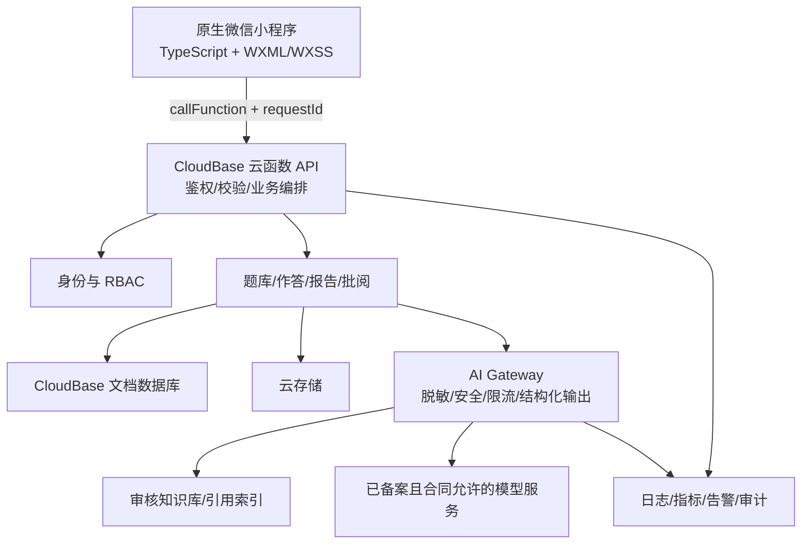
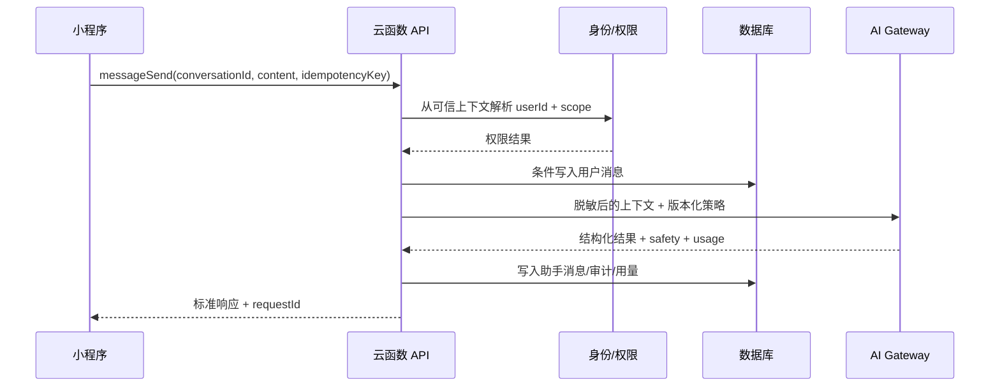

# 03. 目标架构与技术栈

## 1. 架构原则

1. **服务端可信**：身份、角色、资源归属、状态流转和评分均由服务端判断。
2. **单一事实源**：云端数据库是事实数据源，本地存储只做非敏感缓存和草稿。
3. **先模块化单体，后按证据拆分**：当前规模不需要微服务。
4. **AI 是不可靠外部依赖**：所有输出需校验、可回退、可追溯，不直接驱动高风险决策。
5. **医学安全内建**：风险分类、标识、引用、人工复核不是上线后的附加项。
6. **可演进**：MVP 继续使用 CloudBase 云函数，达到明确阈值后再迁移云托管/关系库。

## 2. 推荐目标架构



CloudBase 官方将云函数定位为事件驱动的 Serverless 后端，并提供安全规则、监控和多端调用能力，适合当前项目快速完成可信服务端闭环。参见[CloudBase 云函数官方文档](https://cloud.tencent.com/document/product/876/121988/)。

## 3. 技术选型

### 3.1 客户端

| 项目 | 选择 | 约束 |
| --- | --- | --- |
| UI 框架 | 原生微信小程序 | 不在本阶段迁移 Taro/uni-app |
| 语言 | TypeScript 严格模式 | `.ts` 为唯一源码；`.js` 只能是构建产物且不手改 |
| 组件 | 原生 Component + 少量内部业务组件 | 页面与组件必须在 JSON 中明确区分 |
| 状态 | 轻量模块化 store | 仅跨页面共享用户会话、当前组织、草稿；服务端数据不长期复制 |
| 请求层 | `services/api-client.ts` | 统一 requestId、错误码、重试、超时、登录失效处理 |
| 校验 | JSON Schema 或轻量运行时 schema | TypeScript 类型不能替代运行时返回值校验 |
| 样式 | WXSS + design tokens | 颜色、间距、字号和状态样式统一变量化 |

为什么不现在使用跨端框架：项目只有微信小程序端，已有大量 WXML/WXSS；迁移会同时改变编译链、组件语义和调试方式，却不能解决权限、数据、AI 安全等真正阻断项。只有确定 6 个月内必须同步交付 H5/支付宝/抖音等多端时，才重新评估 Taro/uni-app。

### 3.2 后端

#### MVP 推荐

- CloudBase 普通云函数；
- Node.js，选用 CloudBase 控制台当前支持的活跃 LTS 运行时；
- TypeScript 编译后部署；
- 一个仓库内按领域拆分函数，共享 `packages/shared`；
- 使用服务端微信调用上下文识别用户；
- 数据访问统一经过 repository，不允许页面直写核心集合。

建议函数边界：

```text
authMe
questionList / questionGet
questionDraftSave / questionPublish
conversationStart / messageSend / conversationComplete
submissionSubmit / submissionList / submissionGet
reviewSave / reviewPublish
consentUpdate / dataSubjectRequest
adminRoleGrant
```

函数可以物理合并以控制部署数量，但 API 契约和权限策略应按上述用例隔离。

#### 何时升级到云托管

满足任一条件时评估 CloudBase 云托管 + NestJS/Fastify：

- 需要标准 HTTP API 提供给 Web 管理端或第三方；
- 需要稳定流式响应、长连接或复杂中间件；
- 单个业务请求编排较长，云函数冷启动/超时成为 SLO 瓶颈；
- 需要统一 OpenAPI、后台任务队列或更成熟的服务治理；
- 团队增长后需要强模块边界和依赖注入。

不要因为“未来可能扩展”就立即上微服务。先做模块化单体，并通过接口、repository 和领域事件保留拆分点。

### 3.3 数据库

#### MVP：CloudBase 文档数据库

适合快速落地会话、消息、题目版本和报告文档。必须配置服务端访问、最小权限规则、复合索引、分页游标和备份。

#### 规模化：MySQL/TDSQL

当出现以下需求时迁移核心教务与批阅数据：

- 组织—课程—班级—成员存在大量多对多关系；
- 统计查询和报表成为主要负载；
- 强事务覆盖作业提交、名额/次数、多人批阅；
- 需要 BI、标准 SQL、严格唯一约束和成熟迁移工具。

CloudBase 当前同时提供文档型数据库和 MySQL 能力，参见[官方功能说明](https://cloud.tencent.com/document/product/876/40406)。迁移时可以保留大体量消息/模型原始结果在文档库或对象存储，把关系强、交易强的数据放入 MySQL。

### 3.4 AI 层

- 只允许服务端访问模型；密钥放在平台密钥/环境变量管理中；
- AI Gateway 统一模型路由、超时、重试、限流、预算、脱敏和审计；
- 高风险分类器先于生成模型；输出后再做 schema、安全和引用校验；
- 模型供应商必须满足数据处理、保存、训练用途、地域、SLA 和备案/登记要求；
- 模型名、提示词版本、知识库版本、温度等生成参数写入报告元数据；
- 医学知识问答优先 RAG + 审核来源，不依赖模型记忆直接作答。

详细设计见[AI 工程与医学安全](./06-ai-engineering-and-medical-safety.md)。

### 3.5 工程工具

| 能力 | 推荐 |
| --- | --- |
| 包管理 | npm + 提交 `package-lock.json`；CI 使用 `npm ci` |
| 格式化 | Prettier |
| 静态检查 | ESLint + TypeScript ESLint；禁止 `any` 逐步收紧 |
| 单元测试 | Vitest 或 Jest，二选一统一 |
| API 契约 | TypeScript 类型 + JSON Schema；若上 HTTP 服务再生成 OpenAPI |
| 安全 | secret scan、依赖漏洞扫描、SAST、生产包敏感词扫描 |
| CI/CD | GitHub Actions/企业现有流水线 + CloudBase CLI/平台部署能力 |
| 文档 | Markdown + Mermaid + ADR |

## 4. 推荐目录

```text
miniprogram/
  app.ts
  components/
  pages/
  services/
    api-client.ts
    auth-service.ts
    question-service.ts
    conversation-service.ts
  stores/
  models/
  utils/
  styles/
cloudfunctions/
  authMe/
  question/
  conversation/
  submission/
  review/
  admin/
packages/
  shared/
    contracts/
    errors/
    validation/
    auth/
  ai-gateway/
    prompts/
    schemas/
    safety/
    providers/
scripts/
  migrate/
  seed/
  verify-release/
tests/
  contract/
  e2e/
docs/
```

若微信开发者工具不便直接解析 monorepo 共享包，应在构建阶段复制/打包共享代码，而不是从 `miniprogramRoot` 外做隐式相对导入。

## 5. 请求链路



## 6. 配置与环境

环境至少分为 `dev`、`staging`、`prod`：

- 小程序只保存非敏感环境标识；
- 模型密钥、数据库管理凭证仅存在服务端密钥管理；
- 每个环境独立数据库、存储桶、函数和模型预算；
- 生产禁止样例数据、调试日志、`urlCheck: false` 依赖和测试账号；
- 环境配置用 schema 在启动时校验，缺失即失败，不使用静默默认值。

## 7. 架构权衡

| 决策 | 收益 | 代价/应对 |
| --- | --- | --- |
| 保留原生小程序 | 复用 UI，最短交付路径 | 多端复用弱；到达真实多端需求再评估 |
| MVP 使用文档库 | 迭代快，契合当前 CloudBase | 关系和统计复杂；提前规范 ID、repository 和迁移版本 |
| 模块化单体 | 部署与调试简单 | 需要代码评审维持边界 |
| AI Gateway | 安全、可观测、可切模型 | 初期多一层代码；通过统一 SDK 降低使用成本 |
| 结构化 AI 输出 | 可校验、可评分、可追溯 | 模型可能不遵循 schema；必须重试/修复/失败降级 |

## 8. 明确不推荐

- 客户端保存或请求任何模型密钥；
- 客户端直接写 `users`、`roles`、`reports`、`reviews`、`audit_logs`；
- 继续同时手工维护 TS 和 JS；
- 以本地存储作为报告和题库事实源；
- 在没有评测集和回滚能力的情况下自动升级模型；
- 将整段真实医疗对话原样发送给未完成数据处理评估的第三方；
- 仅靠系统提示词实现医疗安全；
- 一开始拆成多仓库/多微服务/Kubernetes。
