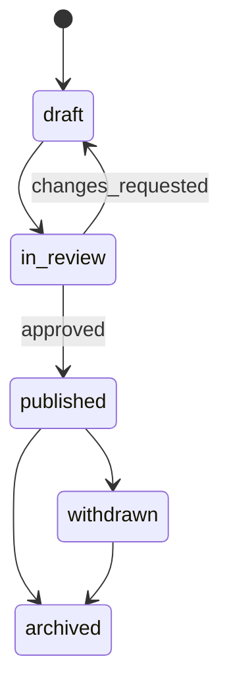
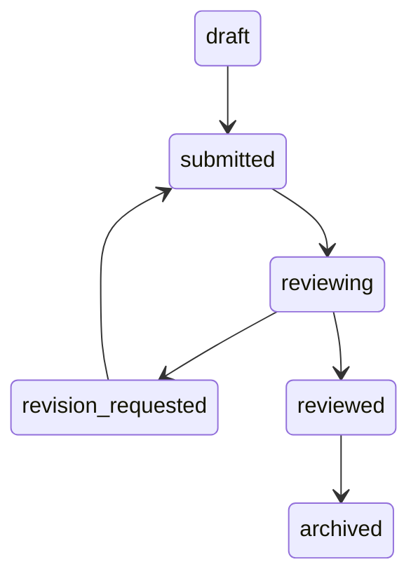

# 04. 领域与数据模型

## 1. 建模原则

- 使用服务端生成的稳定业务 ID；不要混用数据库 `_id`、`conversationId` 和页面参数。
- 所有实体包含 `createdAt`、`updatedAt`，关键实体包含 `version` 以支持乐观锁。
- 时间统一存 UTC 时间戳，界面按用户时区格式化。
- 状态保存机器可读英文枚举，中文只在 UI 映射，避免查询依赖“待批阅”等展示文本。
- 正文、元数据、统计字段分离；敏感字段标注数据等级。
- 发布后的题目和评分量表不可原地修改，必须创建版本。
- 删除默认使用可追踪的软删除；达到保留期后做可验证的物理删除。

## 2. 领域关系

```mermaid
erDiagram
    USER ||--o{ MEMBERSHIP : joins
    ORGANIZATION ||--o{ MEMBERSHIP : contains
    COURSE ||--o{ CLASS : owns
    CLASS ||--o{ CLASS_MEMBER : contains
    USER ||--o{ CLASS_MEMBER : participates
    QUESTION ||--|{ QUESTION_VERSION : versions
    QUESTION_VERSION ||--o{ ASSIGNMENT : assigned_as
    ASSIGNMENT ||--o{ CONVERSATION : starts
    USER ||--o{ CONVERSATION : owns
    CONVERSATION ||--|{ MESSAGE : contains
    CONVERSATION ||--o| SUBMISSION : submitted_as
    SUBMISSION ||--o| AI_REPORT : evaluated_by
    SUBMISSION ||--o{ REVIEW : reviewed_by
    USER ||--o{ REVIEW : authors
    USER ||--o{ CONSENT : grants
    USER ||--o{ AUDIT_LOG : acts
```

## 3. 集合设计

以下为逻辑模型。MVP 可在 CloudBase 文档库实现；规模化迁移 MySQL 时保持业务字段和状态语义不变。

### 3.1 `users`

| 字段 | 类型 | 说明 |
| --- | --- | --- |
| `_id` | string | 数据库内部 ID |
| `userId` | string | 稳定业务 ID，如 UUID/ULID；API 只暴露它 |
| `openidHash` | string | 用于服务端查找；避免在业务文档中传播明文 openid |
| `displayName` | string | 最小化资料，非必需不收集真实姓名 |
| `avatarFileId` | string? | 经同意保存的头像 |
| `status` | enum | `active/suspended/deleted` |
| `createdAt/updatedAt` | datetime | 审计时间 |

不要把 `role` 直接放在用户可更新资料里。角色与范围放入独立绑定。

### 3.2 `role_bindings`

```json
{
  "bindingId": "rb_...",
  "userId": "usr_...",
  "role": "teacher",
  "scopeType": "course",
  "scopeId": "course_...",
  "status": "active",
  "grantedBy": "usr_admin...",
  "grantedAt": "server timestamp",
  "expiresAt": null
}
```

唯一约束：`userId + role + scopeType + scopeId + status(active)`。教师绑定只能由管理用例创建。

### 3.3 组织与教学关系

- `organizations`：学校/机构；
- `courses`：课程、学期、所属组织；
- `classes`：行政班/教学班；
- `class_members`：`classId + userId + memberRole + status`；
- `course_teachers` 可由 `role_bindings` 表达，避免重复模型。

如果 MVP 只有一个学校，也不要把组织概念写死；可创建默认组织，但 API 仍携带 scope。

### 3.4 `questions` 与 `question_versions`

`questions` 保存稳定 ID 和当前版本指针：

```json
{
  "questionId": "q_...",
  "organizationId": "org_...",
  "ownerUserId": "usr_teacher...",
  "currentVersionId": "qv_...",
  "lifecycleStatus": "published",
  "createdAt": "...",
  "updatedAt": "...",
  "version": 3
}
```

`question_versions` 保存不可变内容：

```json
{
  "questionVersionId": "qv_...",
  "questionId": "q_...",
  "versionNo": 2,
  "type": "case_analysis",
  "title": "...",
  "description": "...",
  "difficulty": "medium",
  "knowledgeTags": ["respiratory", "pneumonia"],
  "rubric": [{"dimension": "reasoning", "maxScore": 40}],
  "referenceSourceIds": ["src_..."],
  "safetyLabels": ["medical_education"],
  "createdBy": "usr_...",
  "createdAt": "..."
}
```

题目状态：



### 3.5 `assignments`

| 字段 | 说明 |
| --- | --- |
| `assignmentId` | 作业/发布实例 ID |
| `questionVersionId` | 固定指向一个不可变题目版本 |
| `courseId` | 课程范围 |
| `targetType` | `class/users`；“全体”应解析成明确课程范围 |
| `targetIds` | 班级或用户 ID；规模大时拆 `assignment_targets` |
| `opensAt/dueAt` | 开始和截止时间 |
| `maxAttempts` | 最大作答次数 |
| `status` | `scheduled/open/closed/cancelled/archived` |
| `publishedBy/publishedAt` | 发布审计 |

不要把目标用户 JSON 放在 URL 中，也不要依赖客户端过滤。

### 3.6 `conversations` 与 `messages`

`conversations`：

```json
{
  "conversationId": "conv_...",
  "ownerUserId": "usr_...",
  "assignmentId": "assign_...",
  "attemptNo": 1,
  "mode": "simulated_consultation",
  "status": "active",
  "messageCount": 6,
  "lastMessageAt": "...",
  "createdAt": "...",
  "completedAt": null,
  "version": 6
}
```

`messages` 每条独立文档，避免每次复制整个会话：

```json
{
  "messageId": "msg_...",
  "conversationId": "conv_...",
  "seq": 7,
  "role": "student",
  "content": "...",
  "contentRedacted": "...",
  "aiGenerated": false,
  "safety": {"riskLevel": "low", "labels": []},
  "modelTraceId": null,
  "createdAt": "..."
}
```

唯一约束：`conversationId + seq`、`messageId`。对于大模型调用，可先持久化用户消息，再异步/同步写助手消息，失败状态显式可见。

### 3.7 `submissions`、`ai_reports`、`reviews`

`submissions` 是学生正式提交行为：

| 字段 | 说明 |
| --- | --- |
| `submissionId` | 统一报告/批阅路由参数，不再传 conversationId 代替 |
| `conversationId` | 来源会话 |
| `assignmentId/userId` | 权限与统计维度 |
| `status` | `draft/submitted/reviewing/revision_requested/reviewed/archived` |
| `submittedAt` | 服务端时间 |
| `currentReviewId` | 已发布教师评价 |
| `version` | 乐观锁 |

`ai_reports` 保存一次模型评估，允许重跑但不覆盖：

```json
{
  "aiReportId": "air_...",
  "submissionId": "sub_...",
  "status": "generated",
  "score": 82,
  "dimensions": [{"code": "reasoning", "score": 33, "maxScore": 40, "evidenceMessageIds": ["msg_..."]}],
  "summary": "...",
  "improvements": ["..."],
  "citations": [{"sourceId": "src_...", "locator": "section..."}],
  "model": {"provider": "...", "modelId": "...", "modelVersion": "..."},
  "promptVersion": "report-v3",
  "knowledgeBaseVersion": "kb-2026-08",
  "generatedAt": "...",
  "safetyStatus": "passed"
}
```

`reviews` 每次保存新版本：`reviewId`、`submissionId`、`reviewerUserId`、`score`、`feedback`、`decision`、`versionNo`、`publishedAt`。

批阅状态机：



### 3.8 合规与运维集合

- `consents`：同意类型、政策版本、状态、时间、渠道和证据；撤回新增事件而非覆盖历史。
- `audit_logs`：actor、action、resource、scope、requestId、结果、IP/设备摘要、变更摘要；禁止记录密钥和完整医疗正文。
- `idempotency_keys`：用户、用例、键、请求摘要、响应摘要、过期时间。
- `safety_events`：风险类别、处置、策略版本、人工复核状态；访问权限严格隔离。
- `model_runs`：模型调用 trace、延迟、token、费用、安全结果和版本，不保存非必要明文输入。
- `knowledge_sources`：来源、版权/许可、版本、有效期、审核人和内容哈希。
- `data_subject_requests`：查阅、导出、更正、删除、撤回的工单与完成证据。

## 4. 索引建议

| 集合 | 索引 |
| --- | --- |
| `users` | `openidHash` unique；`userId` unique |
| `role_bindings` | `userId,status`；`scopeType,scopeId,role,status` |
| `question_versions` | `questionId,versionNo` unique |
| `assignments` | `courseId,status,dueAt`；目标拆表后 `targetId,status` |
| `conversations` | `ownerUserId,lastMessageAt desc`；`assignmentId,ownerUserId,attemptNo` unique |
| `messages` | `conversationId,seq` unique；`conversationId,createdAt` |
| `submissions` | `userId,submittedAt desc`；`assignmentId,status,submittedAt desc`；`conversationId` unique |
| `reviews` | `submissionId,versionNo` unique；`reviewerUserId,createdAt desc` |
| `audit_logs` | `resourceType,resourceId,createdAt desc`；`actorUserId,createdAt desc`；TTL/归档策略 |
| `idempotency_keys` | `userId,useCase,key` unique；`expiresAt` TTL |

索引必须由查询用例驱动，并在 staging 使用接近生产量级的数据验证。

## 5. 并发与一致性

- 关键写入在事务内完成：提交作业同时锁定 attempt、创建 submission、更新 assignment 统计。
- 批阅使用 `version` 条件更新：请求携带 `expectedVersion`，不匹配返回 `CONFLICT`。
- 所有创建接口使用幂等键；相同键与不同请求体组合应拒绝。
- 统计数据允许最终一致，由异步任务重算；成绩和权限不能依赖最终一致缓存。
- 时间、ID、角色和状态全部由服务端生成或确认。

## 6. 数据分级与保留

| 级别 | 示例 | 处理 |
| --- | --- | --- |
| L1 公开 | 已批准公开的题目知识来源 | 可按发布策略公开 |
| L2 内部 | 系统配置、匿名聚合指标 | 员工最小权限 |
| L3 个人 | 昵称、班级、学习记录 | 加密、访问控制、用途限制 |
| L4 敏感 | 医疗对话、健康描述、未成年人信息、身份映射 | 单独同意、强审计、脱敏、严格保留期和导出限制 |
| L4 凭证 | 模型密钥、管理令牌 | 密钥管理，绝不进数据库日志/客户端 |

保留期限由法务、教学需求和合同共同确定；不能写“永久”。建议把每类数据的 `retentionPolicyId` 与策略版本关联，定时任务执行到期归档/删除，并产生日志。

## 7. 从 Demo 数据迁移

当前本地数据没有可信用户归属，默认不应自动导入生产。

迁移步骤：

1. 冻结旧字段定义并写一次性解析器；
2. 仅在 dev/staging 导入样例题目，标注 `source=demo`；
3. 不导入客户端模拟 openid；
4. 不导入含真实健康信息的本地对话，除非获得合法依据和明确授权；
5. 把中文状态映射为英文枚举；
6. 为报告生成新的 `submissionId`，保留旧 conversationId 仅作 `legacyId`；
7. 输出迁移数量、跳过数量、哈希校验和回滚记录；
8. 迁移脚本可重复运行且具备 dry-run，不在客户端执行。
