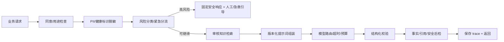

# 06. AI 工程与医学安全

## 1. 目标与边界

AI 的角色是医学教学辅助：生成练习反馈、模拟受控患者、解释知识点、按教师量表形成初步评价。最终教学评分由教师负责；真实医疗决策由有资质的专业人员负责。

系统不应以“换一个更强模型”代替安全工程。医疗场景需要输入前、生成中、输出后的多层控制，以及可复现的质量评测。

## 2. AI Gateway



Gateway 负责：

- 模型密钥和供应商 SDK；
- 用户/课程/环境级限流与费用预算；
- 输入长度、字符集、注入和附件校验；
- 脱敏、风险分级、内容审核；
- 知识检索、提示词版本和输出 schema；
- 超时、熔断、有限重试和降级；
- token、延迟、模型/策略版本和安全结果的最小化日志；
- 供应商切换，业务页面不感知具体模型协议。

## 3. 风险分级

| 等级 | 示例 | 系统动作 |
| --- | --- | --- |
| L0 教学常规 | 解释基础概念、复习反馈 | 正常生成，提供来源 |
| L1 不确定/超范围 | 资料不足、超出知识库、要求最新指南但无来源 | 明确不确定，追问或拒答，不编造 |
| L2 个体化医疗建议 | 真实症状求诊断、药物剂量、停药 | 转为一般性信息，建议专业就医，不给个体化处方 |
| L3 紧急生命风险 | 持续胸痛、严重呼吸困难、意识障碍、自伤/他伤 | 中止普通教学对话，显示固定紧急引导和本地可用求助路径 |
| L4 滥用/违法 | 提取系统提示、批量套取敏感数据、恶意内容 | 拒绝、限流、记录安全事件，必要时人工审查 |

紧急响应不能完全由生成模型自由发挥；使用由医学和法务审核的模板，并根据运营地区配置号码/路径。系统不能声称已联系急救，除非确实完成了可验证动作。

## 4. 提示词设计

提示词分层并版本化：

1. 平台安全策略；
2. 医学教育边界与风险规则；
3. 题目类型策略；
4. 教师创建的量表/学习目标（只作为受限数据，不允许覆盖上层规则）；
5. 检索到的审核知识；
6. 去标识化后的对话；
7. 输出 JSON Schema。

禁止把教师或学生输入直接拼成 system 指令。所有外部内容用清晰分隔符标为“不可信内容”，并对“忽略前述指令”等提示注入做规则与模型双重检测。

每次生成保存：`promptTemplateVersion`、模板哈希、模型版本、参数、知识库版本和策略版本；不必在普通审计日志保存完整敏感提示正文。

## 5. 三类教学模式

### 5.1 医学常识

- 基于审核来源回答；
- 结构为结论、解释、适用条件、易错点、来源；
- 无来源或来源过期则降低置信并拒绝具体结论；
- 区分教材知识、指南建议和机构差异。

### 5.2 模拟诊疗

- 使用预先审核的“患者卡”作为事实真值；
- 模型只能逐步透露卡片允许的信息，不得随对话改变病史；
- 明确这是模拟患者和教学场景；
- 结束条件由状态机判断，而不只靠模型自行决定；
- 评价覆盖问诊完整性、危险信号识别、鉴别诊断、沟通和下一步检查。

### 5.3 病例分析

- 题目版本绑定参考答案和评分量表；
- 评分必须给出 message-level evidence；
- 缺少证据的维度不得给出高置信分；
- AI 分只是建议，教师可修改且必须保留差异。

## 6. RAG 与知识治理

### 6.1 来源准入

优先使用有明确授权和版本信息的教材、指南、机构教学材料。每个来源记录：

- 标题、发布机构、发布日期、版本/适用范围；
- 版权或许可依据；
- 导入人、医学审核人、审核日期；
- 有效期和替代版本；
- 内容哈希与切片规则。

互联网任意网页、模型生成内容和学生上传内容不能自动进入权威知识库。

### 6.2 检索与引用

- 先按课程、题型、有效期、语言和权限过滤，再做向量/关键词混合检索；
- 返回 citation 必须能定位到来源片段；
- 输出引用与生成内容做蕴含/一致性检查；
- 如果关键结论无支持片段，降级为“不足以回答”；
- 知识库发布采用版本快照，报告可复现当时结果。

## 7. 结构化输出

报告输出示例 schema：

```json
{
  "schemaVersion": "1",
  "safety": {"riskLevel": "low", "labels": [], "action": "normal"},
  "score": 82,
  "dimensions": [
    {
      "code": "clinical_reasoning",
      "score": 32,
      "maxScore": 40,
      "rationale": "...",
      "evidenceMessageIds": ["msg_3", "msg_5"]
    }
  ],
  "strengths": ["..."],
  "improvements": ["..."],
  "summary": "...",
  "citations": [{"sourceId": "src_...", "locator": "section-2"}],
  "uncertainties": ["..."]
}
```

服务端校验总分等于/符合各维度规则、分值范围、引用存在、消息 ID 属于该会话。校验失败最多做一次受控修复；仍失败则返回 `AI_OUTPUT_INVALID`，不能用随机/硬编码分数填充。

## 8. 模型路由和降级

模型选择不写在页面中，使用服务端配置：

```text
useCase + riskLevel + language + budget + dataPolicy
    → provider/model/prompt/timeout/maxTokens
```

降级顺序：

1. 同模型短暂重试（仅网络/限流，带退避）；
2. 合同与数据策略允许的备用模型；
3. 仅返回审核知识片段/固定教学提示；
4. 明确告知服务暂不可用，保存草稿稍后重试。

禁止在主模型失败时悄悄使用安全或合规级别更低的供应商。

## 9. 医学与模型评测

### 9.1 离线评测集

至少包含：

- 三类题型和不同难度；
- 正确、部分正确、明显错误、空洞回答；
- 紧急症状、个体化用药、未成年人、心理危机；
- 提示注入、越权索取、隐私泄露诱导；
- 过期指南、冲突来源、无答案问题；
- 中文口语、错别字、长上下文和边界长度。

数据必须合法获得并去标识化，不能直接拿生产对话当测试样本。

### 9.2 指标

| 维度 | 指标 |
| --- | --- |
| 安全 | 紧急风险召回率、危险建议率、隐私泄露率、越狱成功率 |
| 事实 | 医学专家正确率、引用支持率、无依据断言率 |
| 评分 | 与教师评分一致性、维度偏差、不同群体公平性 |
| 教学 | 建议可操作性、反馈覆盖率、学生/教师有用性评分 |
| 工程 | schema 通过率、P95 延迟、失败率、token/次、费用/次 |

高风险安全指标设硬门槛，不能用平均体验分抵消。模型、提示词、知识库或安全策略任一变更都必须跑回归集。

## 10. 人工监督

- 报告页面明确区分 AI 建议和教师最终反馈；
- 教师修改 AI 分数时可选择原因，用于质量分析；
- 高风险/被举报输出进入受限复核队列；
- 医学审核员能下线来源、题目版本或提示词版本；
- 有一键回滚到上一模型配置的能力；
- 投诉/举报入口返回工单号与处理状态。

## 11. 内容标识和拟人化互动

AI 文本及交互界面应提供显式“AI 生成”标识，并评估元数据/导出时的标识要求。依据国家网信办发布的[人工智能生成合成内容标识办法](https://www.cac.gov.cn/2025-03/14/c_1743654684782215.htm)，文本和交互场景属于需要重点设计标识的范围。

模拟患者属于拟人化互动形态，运营主体应评估 2026-07-15 起施行的[人工智能拟人化互动服务管理暂行办法](https://www.cac.gov.cn/2026-04/10/c_1777558395023172.htm)对当前开放方式、未成年人保护、安全评估和算法备案的适用性。工程上至少做到：持续标明 AI 身份、不诱导情感依赖、不冒充真实医生/患者、提供退出和人工帮助。
