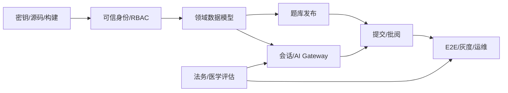

# 10. 实施路线与优先级

## 1. 总体策略

路线以 12 周为一个参考周期，目标是从交互 Demo 达到“小范围受控教学试点”，不是直接达到大规模公众服务。实际排期取决于团队、医学审核、法务评估和微信/模型平台审批时间。

优先级定义：

- **P0**：安全或数据完整性阻断；不完成不能继续试点。
- **P1**：完成核心业务闭环和工程基线；MVP 必须。
- **P2**：提升效率、统计、体验与规模能力；可在 MVP 后。
- **P3**：探索性增强；必须有数据证明价值。

## 2. P0 Backlog

| ID | 工作项 | 完成标准 |
| --- | --- | --- |
| P0-01 | 轮换泄露的 AI 密钥并审计用量 | 旧密钥失效；事件记录完成；生产包 secret scan 通过 |
| P0-02 | 模型请求迁移服务端 | 客户端无 Authorization/API key；模型域名不再由小程序直连 |
| P0-03 | 统一 TypeScript 源码 | 每个逻辑文件只有一个权威源；手写 JS 分叉清除；typecheck 通过 |
| P0-04 | 恢复可重复构建 | 提交 lockfile；`npm ci`、Lint、typecheck、test、build 在干净环境通过 |
| P0-05 | 建立可信身份 | 服务端从可信上下文识别用户；忽略客户端 openid/role |
| P0-06 | 教师准入与 RBAC | 普通用户不能自选教师；教师由管理员邀请/授予并有 scope |
| P0-07 | 修复资源级越权 | 学生/教师跨账号、跨班、枚举 ID 测试全部失败关闭 |
| P0-08 | 统一业务 ID | submission/report 路由不再混用 conversationId 与 `_id` |
| P0-09 | 敏感数据与产品边界 | 同意、隐私说明、AI 标识、教育用途/非诊疗声明可用 |
| P0-10 | 医疗紧急安全策略 | 高风险黄金集通过；固定升级/急救引导经过医学审核 |

## 3. 12 周参考计划

### 第 1–2 周：安全止血与工程收口

交付：

- 密钥轮换、供应商日志检查、客户端 AI 调用关闭；
- 确认 TypeScript 为唯一源码，整理生成物策略；
- package lock、Lint、format、typecheck、基础测试与 CI；
- `dev/staging/prod` 配置模型和环境 schema；
- 修复缺失资源、组件声明、死路由和页面/组件职责；
- 建立数据流图、威胁模型、数据清单和合规 owner。

退出标准：干净环境构建成功；客户端包无密钥；当前明显坏链路全部列入自动检查。

### 第 3–4 周：可信身份与基础数据

交付：

- `authMe`、用户、role bindings、组织/课程/班级/成员；
- 管理员教师邀请/授予最小流程；
- 服务端鉴权中间层、schema 校验、标准错误和 requestId；
- 版本化 migration 和 dev seed；
- 权限单测/集成测试；
- 本地存储降级为缓存，退出登录时清除敏感缓存。

退出标准：篡改客户端 role/openid 无效；教师只能访问明确 scope。

### 第 5–6 周：题库与发布闭环

交付：

- question/question_version/assignment 数据模型；
- 教师草稿、审核、发布、撤回；
- 指定课程/班级/学生目标；
- 学生列表从服务端读取，不再硬编码；
- 截止时间、作答次数和状态；
- 补齐或暂时移除问题详情/统计等死路由。

退出标准：教师发布后只有目标学生可见；版本和审核记录可追溯。

### 第 7–8 周：对话、AI Gateway 与报告

交付：

- conversations/messages 服务端模型，按 ID 更新而非保存快照；
- messageSend 幂等、顺序、超时、取消和失败恢复；
- AI Gateway、供应商 adapter、限流、预算、脱敏和结构化输出；
- 三类题型版本化提示词；
- ai_reports schema、模型/提示/知识版本 trace；
- AI 显式标识、风险分级和紧急响应。

退出标准：跨设备恢复同一会话；模型失败不丢用户消息；非法模型输出不生成报告。

### 第 9–10 周：提交、教师批阅与隐私权利

交付：

- submission 状态机和正式提交幂等；
- 教师列表分页/筛选、详情、评分草稿、发布、退回修改；
- 乐观锁与评分审计，0 分合法；
- 学生查看最终反馈；
- 同意记录、数据查看/导出/删除/注销工单；
- 审计日志与敏感查看告警。

退出标准：核心 E2E 通过；并发批阅不覆盖；数据主体请求可演练。

### 第 11–12 周：硬化与试点准备

交付：

- 全量权限、安全、AI 医学黄金集与 E2E 回归；
- staging 压测、成本估算、机型兼容、弱网测试；
- 指标、告警、SLO、runbook、备份恢复和回滚演练；
- 模型供应商/备案登记/数据处理/隐私影响评估确认；
- 医学审核、法务、安全、产品 Go/No-Go；
- 内部账号 → 单班级灰度方案。

退出标准：[上线验收清单](./12-release-readiness-checklist.md)所有阻断项通过，明确试点范围和停止条件。

## 4. P1/P2 Backlog

### P1：MVP 必须

- 统一 design tokens、加载/错误/空状态组件；
- 服务端分页 cursor 和列表摘要 DTO；
- 报告引用、证据 messageId 和不确定性；
- 投诉/举报与人工复核队列；
- 模型/提示词/知识库回滚；
- 审计搜索和敏感访问告警；
- 数据保留和定时删除；
- 备份恢复演练；
- 核心漏斗和 AI 成本看板。

### P2：试点后

- Web 教师/管理员后台（确有桌面效率需求时）；
- 课程统计、知识点热力图和 CSV 导出；
- 流式响应和生成任务队列；
- 作业模板、题目复制、批量导入；
- 双人审核/抽检策略；
- 订阅消息提醒；
- 无障碍、国际化和更完整机型适配；
- 根据查询证据迁移部分数据到 MySQL/TDSQL。

### P3：有证据再做

- 多端框架迁移；
- 自训练/微调医学模型；
- 实时语音或虚拟患者形象；
- 公开题库社区；
- 多微服务/独立消息平台；
- 自适应学习推荐。

这些功能显著增加合规、安全、成本或架构复杂度，应先验证教学价值。

## 5. 团队建议

受控 MVP 的最小有效团队：

| 角色 | 建议投入 | 职责 |
| --- | ---: | --- |
| 产品/项目 | 1 | 范围、流程、验收、协调审批 |
| 小程序工程师 | 1–2 | 页面重构、请求层、组件、E2E |
| 后端/CloudBase | 1–2 | 身份、数据、API、迁移、运维 |
| AI 工程师 | 1 | Gateway、RAG、评测、成本 |
| 测试/质量 | 1 | 测试体系、兼容、安全回归 |
| 医学专家 | 至少 1，持续参与 | 题目、提示、安全模板、黄金集、抽检 |
| 安全/隐私/法务 | 阶段性但必须 | 威胁/影响评估、供应商、上线签字 |

若资源不足，缩小试点范围和题型，不应省略身份安全、医学审核和隐私控制。

## 6. 依赖与关键路径

医学与法务评估不可留到第 12 周才启动；模型合同、备案/登记、未成年人和数据流向可能改变产品范围。

## 7. 风险与缓解

| 风险 | 缓解 |
| --- | --- |
| 为赶页面跳过后端权限 | P0 门禁；所有核心接口先写权限测试 |
| TS/JS 再次分叉 | 生成物不手改；CI 校验；Code Owner |
| 模型质量波动 | 固定版本、评测集、灰度和一键回滚 |
| 医疗专家投入不足 | 缩小题型/知识范围；未审核内容不发布 |
| 文档库统计变复杂 | repository 隔离；异步聚合；达到阈值再迁 SQL |
| 合规审批拖期 | 第 1 周启动；明确试点是内部还是公众 |
| 小程序审核与后端版本错配 | 后端兼容 N-1 客户端；功能开关和灰度 |

## 8. Definition of Done

每个业务工作项完成必须满足：

- 验收标准和异常路径已实现；
- 服务器权限和输入 schema 已测试；
- 无新增客户端密钥/敏感日志；
- 单元、契约、集成/必要 E2E 通过；
- 数据变更有 migration、兼容和回滚策略；
- 指标、错误码和必要审计已接入；
- 用户文案包含适用的 AI/医学/隐私说明；
- 文档和 API 契约同步；
- staging 验证通过并可回退。

## 9. MVP 成功指标

技术指标之外，还应验证教学价值：

- 目标学生作业可见/提交成功率；
- 教师完成批阅的时间与 AI 建议采纳/修改原因；
- 学生对反馈有用性评价；
- AI 报告被教师判定为危险/严重错误的比例；
- 关键知识点提升（前后测或对照设计）；
- 每次有效练习的模型成本；
- 隐私/安全投诉和退出率。

不要用消息数、token 数或停留时长单独证明医学教学有效。
