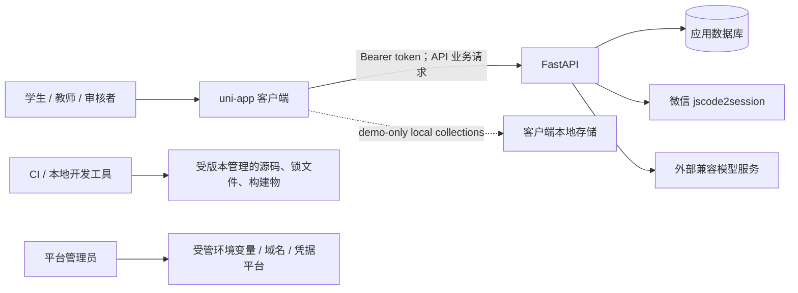

# T06-01 安全、隐私与发布边界基线

任务编号／阶段：T06-01／S0 只读静态盘点。执行工作树：`C:\Users\adj\.codex\worktrees\f581\wxprogrom7.15`。本记录不代表 T06 已验收，也不代替生产环境、凭据平台或医学审核的证据。

## 范围、基线与方法

- 起始时 `git status --short` 显示前后端、契约和页面的既有修改及未跟踪的 `docs/update_plan/`；其中包括本任务外的业务代码、迁移和已删除的 `docs/update/README.md`。本任务只新增本文件，未恢复、覆盖、提交、推送或合并任何既有改动。
- 已阅读根 `AGENTS.md`、计划总览及 T06 任务书、`docs/security.md`、`docs/data-layer.md`、`docs/deployment.md`、认证/依赖/配置/路由/模型/DTO、缓存和 AI 服务的当前源码与相关测试源码。
- 本次未运行后端测试、E2E、`check:all`、迁移、seed 或访问任何业务数据库：T01 的受管临时数据库与 DB-01/DB-02 证据尚不存在。T06-01 盘点及后续 T06-02 扫描均未读取、输出或轮换历史真实凭据；T06-02 的脚本、校验、自测及脱敏结果见 [T06-secrets.md](T06-secrets.md)。扫描器尚未接入 `package.json`/CI 门禁。

## 资产与信任边界

| 资产                                                 | 允许的主要流向                                          | 已见控制                                                                                                                                                                                                                      | 尚需确认                                                                           |
| ---------------------------------------------------- | ------------------------------------------------------- | ----------------------------------------------------------------------------------------------------------------------------------------------------------------------------------------------------------------------------- | ---------------------------------------------------------------------------------- |
| JWT、微信 code、openid／账号来源                     | 客户端登录请求 → API；JWT 仅回客户端并随 API 请求发送   | JWT 仅含 subject/expiry；服务端从 bearer token 取 actor；微信 `session_key` 不返回；微信教师角色需服务端白名单（`backend/app/core/security.py:11`，`backend/app/dependencies.py:12`，`backend/app/api/auth.py:48-79`）        | HTTPS、JWT 轮换/撤销、生产 token 存储保护、实际白名单和微信域名配置                |
| 学生聊天、病例答案、报告、学习画像                   | 学生作用域 API → 数据库；受允许教师范围的报告/分析 API  | 对话、attempt、学习任务查询均以 `student_id` 过滤（如 `backend/app/api/conversations.py:65-77`、`backend/app/services/case_training.py:19-32`）；API 响应只做内存缓存                                                         | 报告给教师的最终班级/owner 政策与跨教师隔离（见 R-01）                             |
| 病例 facts、reference reasoning、rubric、审核 digest | 仅创作者/授权审核者的 authoring/review；必要时服务端 AI | 学生 `ProblemRead` 清空定向元数据、作者、能力标签和完整 definition/rubric；attempt 不返回 `revealed_fact_ids`（`backend/app/services/problem_view.py:12-43`，`backend/app/services/case_training.py:35-61`）                  | 外部模型的数据处理授权；评估服务向模型传递 rubric/reference reasoning 的最小化依据 |
| 医学审核记录、评论、digest                           | 授权审核者或病例作者 → API/DB                           | `medical_review` 需要教师及 permission；作者不能自审；发布时比对 digest（`backend/app/dependencies.py:33-41`，`backend/app/api/medical_review.py:76-109`，`backend/app/api/problems.py:230-261`）                             | 权限授予/回收的管理来源、真实医学审核签署                                          |
| AI 凭据、微信 AppSecret、JWT secret、数据库 URL      | 仅受管后端环境 → 服务端外部调用                         | 前端示例禁止 VITE 变量携带服务端秘密；配置由后端 settings 读取；AI 调用的 Authorization 只在服务端构造（`.env.example`，`backend/.env.example`，`backend/app/services/case_ai.py:82-129`）                                    | 历史模型凭据是否已撤销/轮换、生产 secret 管理和审计（发布 P0 阻塞）                |
| 运行日志与 AI 审计                                   | 服务端日志/DB 元数据 → 运维                             | 未处理异常仅记录 method、route、exception type；AI 表记录元数据、失败类别、关联 ID，不记录 prompt（`backend/app/errors.py:60-67`，`backend/app/services/medical_ai.py:96-114`，`backend/app/models/case_training.py:95-111`） | 框架/反向代理/模型客户端 debug 日志和 CI 制品的实际配置                            |

客户端本地存储是单独的设备信任边界：API token 使用 `apiAccessToken` 持久存储；API 业务响应缓存只在内存，401、登出和会话变更会清 token、会话信息和缓存（`src/services/apiClient.ts:21-30,75-93,151-250`）。Demo 模式可持久化合成业务集合，并按 user scope 管理；`App.vue` 的 `logs` 只保存时间戳。该设计不等同于对失窃/越狱设备的加密保护，须由发布风险接受决定。

## 端点 × 角色矩阵（静态实现）

符号：✓ 可按资源规则访问；— 依赖拒绝；`own` 代表服务端当前实现 owner/member/student 过滤；`review` 为 `medical_review` permission。此表描述代码事实，不替代尚未确认的产品授权政策。

| 端点组                                                  | 未认证             | 学生                        | 教师                                    | 审核者（教师 + review）          | 当前服务端边界与复验重点                                                                  |
| ------------------------------------------------------- | ------------------ | --------------------------- | --------------------------------------- | -------------------------------- | ----------------------------------------------------------------------------------------- |
| `GET /health`                                           | ✓                  | ✓                           | ✓                                       | ✓                                | 仅状态；`backend/app/main.py:68`                                                          |
| `POST /auth/demo-login`                                 | ✓（非 production） | 创建/复用 demo 帐号         | 创建/复用 demo 帐号                     | 固定 `demo_reviewer` 才获 review | production 由 `demo_auth_enabled` 关闭；任意新 demo 请求仍可选择 student/teacher，见 R-02 |
| `POST /auth/wechat-login`                               | ✓                  | ✓                           | ✓（白名单）                             | —                                | code 仅服务端换 openid；请求 role 不能越过教师白名单                                      |
| `/v1/medical-chat`                                      | —                  | ✓                           | ✓                                       | ✓                                | 仅认证，不按角色区分；外部模型数据流见 R-03                                               |
| `/conversations*`                                       | —                  | own                         | —                                       | —                                | 全部 `require_student` 且 query 过滤 `student_id`                                         |
| `/reports` 创建/提交                                    | —                  | own                         | —                                       | —                                | conversation 与 report 均按学生 ID 校验                                                   |
| `/reports` 列表、摘要、详情                             | —                  | own                         | ✓（全部 `pending_review`/`reviewed`）   | ✓（同教师规则）                  | 代码未将教师读报告限制到班级或 owner；完整详情含 messages，R-01                           |
| `/reports/{id}/review`                                  | —                  | —                           | ✓（不按班级/owner）                     | ✓                                | 状态机和 reviewer ID 有保护；审阅范围为 R-01 的同一缺口                                   |
| `/problems` 列表/详情                                   | —                  | 已发布且 assigned；脱敏 DTO | ✓（全部题目元数据）                     | ✓                                | 学生 visibility predicate；教师全局读取是否符合“其他教师 owner 数据”政策待确认，R-04      |
| `/problems` 创建、更新、发布、拒绝、clone、authoring    | —                  | —                           | own（历史 `author_id=None` 可接手）     | own（仍须 teacher）              | 写操作 `_ensure_owned`，authoring 明确等于 author；历史无 owner 的处理需数据治理确认      |
| `/student/questions*`、`/problems/{id}/thread`          | —                  | assigned + own thread       | —                                       | —                                | 题目 predicate 先于列表/详情，thread 按 student ID                                        |
| `/attempts*`、`/learning*`、`/notifications*`           | —                  | own                         | —                                       | —                                | attempt/assessment/plan/task/notification 皆由 student ID 或关联检索限定                  |
| `/classes*`                                             | —                  | —                           | own class                               | own class                        | `_owned` 使用 `ClassRoom.teacher_id`；班级成员增删由 owner 教师执行                       |
| `/analytics/*`                                          | —                  | —                           | own class；case detail 还需 case author | 同教师规则                       | 服务层以教师所属 class/member 取学生；case detail 对其他作者 404                          |
| `/problems/review-queue`、`medical-review-view`、decide | —                  | —                           | —                                       | review                           | 审核 view 可见完整 case definition/rubric，符合审核职责前提但需外部授权证据               |
| `/problems/{id}/medical-review/submit`、history         | —                  | —                           | own author；history 也允许 reviewer     | review                           | 作者不能自审，保存 version + SHA-256 digest                                               |

## 已证实风险与待验证项

| ID   | 结论/优先级                                                             | 证据、攻击前提与影响                                                                                                                                                                                                                                                                                                                                                                     | 现有防护                                                                                                                                               | 归属与下一步                                                                                                                                                                                   |
| ---- | ----------------------------------------------------------------------- | ---------------------------------------------------------------------------------------------------------------------------------------------------------------------------------------------------------------------------------------------------------------------------------------------------------------------------------------------------------------------------------------- | ------------------------------------------------------------------------------------------------------------------------------------------------------ | ---------------------------------------------------------------------------------------------------------------------------------------------------------------------------------------------- |
| R-01 | **已证实实现事实；高优先级授权政策待决（P0，SEC-03）**                  | 任一已认证教师能读取全部 `pending_review`/`reviewed` 报告并批阅；`visible_reports_statement` 在教师分支只有状态条件，`serialize_report` 返回学生名、完整 messages 和分析（`backend/app/api/reports.py:14-51,54-159,224-246`）。若最终政策要求教师仅访问自己班级/被分配范围，则这是跨范围泄露和越权批阅；若产品明确采用全体教师共享审阅队列，则需以审批、最小化字段和审计规则记录该例外。 | 学生分支按 `student_id` 限制；草稿不对教师开放；状态机与 reviewer 留痕存在。                                                                           | 等待负责人确认最终报告授权政策。确认范围隔离后由 T04 修复服务层规则、T05 加跨教师负向回归；确认共享队列也须保留正式政策与风险接受证据。在决策和对应验证完成前阻断真实学生报告发布。            |
| R-02 | **已证实非生产 demo 行为；是否为漏洞取决于演示帐户政策（P1，SEC-04）**  | `LoginRequest.role` 接收 student/teacher，首次 demo 登录将 payload role 写入 User；只禁止同一已建帐号改 role（`backend/app/schemas/auth.py:20-26`，`backend/app/api/auth.py:85-115`）。若非生产环境允许任意本地演示身份，此行为可能符合用途；若 demo endpoint 可被非受信任用户访问或要求固定帐号，则会形成角色自选风险。                                                                 | `APP_ENV=production` 时 endpoint 404；demo 不能冒充已有微信帐号；review permission 限固定 ID。                                                         | 负责人确认 demo 帐户可创建性、访问边界与准许角色后，再决定 allowlist/固定帐号加固及 T05 断言。无论政策如何，SEC-07 仍需生产 demo disabled 的负向证据。                                         |
| R-03 | **已证实代码流；是否违规待数据处理确认（P0 发布前决策，SEC-05/06/09）** | API 医学问答向配置的外部模型发送 prompt 与最多 20 条聊天历史；病例评估向模型发送完整学生答案/消息、reference reasoning 与 rubric（`src/services/ai.ts:47-76`，`backend/app/services/medical_ai.py:49-94`，`backend/app/services/case_ai.py:239-271`）。这些字段可含敏感健康描述或教学隐藏内容。                                                                                          | 不发送 token/身份字段；模型 key 不在客户端；AI 审计不存 prompt；结构化调用最多重试一次，fallback 存在。                                                | 管理员/隐私负责人确认供应商、地区、DPA/保留期、是否允许自由问答携带完整历史；T04 依据批准结果做最小化/脱敏/允许域名控制；T05 做请求内容和审计负向测试。不可将静态“未记录 prompt”视为外发合规。 |
| R-04 | **待验证的授权政策差异（P1，SEC-03）**                                  | 教师的 `/problems` 列表和详情无 author filter，返回其他教师题目 metadata、target IDs、author ID、review status；完整 authoring DTO 仍限制作者（`backend/app/api/problems.py:42-90`，`backend/app/services/problem_view.py:12-49`）。                                                                                                                                                     | 写、publish、clone 均做 ownership；analytics case drill-down 对其他作者 404。                                                                          | 产品负责人确认“内容库可见”与“其他教师 owner 数据不可见”的边界；若需隔离，T04 同时收紧 list/detail、review history 和 OpenAPI，T05 覆盖。                                                       |
| R-05 | **待验证的生产配置与传输边界（P0 发布阻塞，SEC-07/09）**                | 代码只在 production 拒绝默认/短 JWT；CORS、database URL、seed 与微信/AI endpoint 均由环境变量决定（`backend/app/main.py:27-47,60-66`，`backend/app/core/config.py:7-40`）。静态工作树不能证明实际生产 HTTPS/CORS/合法域名/seed/database/secret 来源。                                                                                                                                    | demo 登录 production disabled；lifespan 只在非 production seed。                                                                                       | 由发布管理员在批准的非生产环境做负向启动与配置清单复验，返回脱敏证据；不在本任务访问任何环境或数据库。                                                                                         |
| R-06 | **待验证：历史模型凭据状态未知（P0，SEC-01）**                          | `docs/security.md` 记录初始提交曾含模型 key，当前源码已移除；本任务未读取历史 key。工作树无 key 不证明历史 key 已失效。                                                                                                                                                                                                                                                                  | `.gitignore` 忽略 env；示例不含值。                                                                                                                    | 凭据平台管理员核实撤销/轮换时间、旧 key 状态及调用审计，只返回脱敏凭据指纹/工单/时间；若无法核实，保持发布阻塞。不得轮换、重写历史或要求在聊天提供 secret。                                    |
| R-07 | **部分已验证、仍有发布缺口（P1，SEC-02/05/08）**                        | 应用可见日志调用不输出 request body/token；storage 错误只输出 key；T06-02 工作树扫描为 0，历史扫描发现 3 条旧 `generic-api-key`，且未能覆盖构建物、代理、CI 制品或历史凭据状态。包装器已实现但尚未接入 `package.json`/CI。                                                                                                                                                               | 后端异常处理只记录允许字段（`backend/app/errors.py:60-67`）；前端 API 缓存不落盘；Gitleaks v8.30.1 归档校验、自测和脱敏输出已记录于 `T06-secrets.md`。 | T02 接入跨平台 `security:secrets` 门禁；T06/T02 在双端构建后扫描构建目录；历史 3 条发现逐条核对并由管理员处置，不得用整类/整目录白名单。                                                       |

## 字段、缓存与日志静态结论

- 学生病例公开 DTO 通过 `serialize_problem(..., public_for_student=True)` 排除 `target_ids`、`author_id`、能力标签、完整 definition 和 rubric；公开 opening 及已揭示的患者回复是设计内的教学数据。`CaseAttemptRead` 不含 `revealed_fact_ids`，病例完整性证据见 `backend/tests/test_case_training.py` 的静态用例。
- 结构化评估采用固定 rubric criteria 先算分；模型结果只在 schema、证据逐字匹配、最大三条/每条 160 字及 critical cap 后覆盖反馈/分数（`backend/app/services/case_training.py:216-340`）。审核记录保存版本和 digest，发布复核 digest；此为已见防护，不替代医学专家签署。
- 业务 GET 缓存为内存 `Map`，cache key 含 auth epoch，token 保存、登出或 401 都使缓存失效并通过 epoch 拒绝旧响应；代码限制 128 项（`src/services/apiClient.ts:18-30,75-93,151-250`）。业务 API 响应没有调用 storage write。Demo 的持久集合和 API token 例外必须在设备安全模型中被明确接受。
- 已见 `console` 调用记录错误对象或 storage key，不直接拼接答案/token；后端异常日志也只记录方法/路由/错误类型。仍需在 T06-04 以脱敏回归检查网络失败对象、第三方 debug 开关、代理日志和 CI 制品，而不是仅凭静态搜索宣称无泄漏。

## 与 T05 的测试映射与缺口

以下是已有测试源码的映射，**未执行**；所有后端用例目前含 `drop_all/create_all` 入口，必须等待 T01 受管隔离后才可运行。

| T05 类别                             | 可复用的当前用例（静态定位）                                                                                                                                                        | 必补负向/验收断言                                                                                                                                                                        |
| ------------------------------------ | ----------------------------------------------------------------------------------------------------------------------------------------------------------------------------------- | ---------------------------------------------------------------------------------------------------------------------------------------------------------------------------------------- |
| AUTH / SEC-04                        | `backend/tests/test_auth.py`：微信 code 仅服务端交换、requested_role 不越权、未配置 fail closed、demo 不冒充微信；`test_api.py`：同帐号 role 变更拒绝                               | R-02：全新 demo 帐号不得自行成为 teacher；production 下 demo endpoint/弱 JWT/缺必要 config 的启动或调用拒绝；token 过期/签名错误不泄露细节                                               |
| REPORT / SEC-03/05                   | `backend/tests/test_api.py:test_report_state_flow`、`test_teacher_cannot_review_a_draft_report`；`test_data_layer.py` 的摘要/role scope                                             | R-01：教师 B 对教师 A 班级学生的摘要、详情、按 conversation 查询、列表、review 均 404/403；确认教师 A 正常路径；响应/错误不泄露 messages                                                 |
| CONTENT / CASE / SEC-03/05/06        | `test_api.py` 的题目 owner 与学生脱敏；`test_case_training.py` 隐藏字段；`test_case_hardening.py` 的跨学生 privacy、不可变与评分保护；`test_second_phase.py` 的审核/owner analytics | R-04：跨教师题目 list/detail/review-history 与 policy 一致；学生无 authoring、private rubric/facts/reference/digest；审核者只得到审核流程需要的数据；AI 注入、非法结构、过期 digest 拒绝 |
| CLASS / ANALYTICS / SEC-03           | `test_second_phase.py` 的 class CRUD、permissions、case analytics owner scope；`test_analytics_performance.py`                                                                      | 两教师交叉 class/student/overview/student-detail 全部拒绝；legacy `class_ids` 与 ClassMember 合并规则的身份来源及迁移边界                                                                |
| CACHE / STORAGE / SEC-05             | `src/services/apiClient.spec.ts`、`apiClient.cache.spec.ts`、`auth.spec.ts`、`src/data/storage.spec.ts`                                                                             | 401、logout、身份切换和 mutation 后旧请求不回填；API 业务响应不落盘；日志 mock 不含 token、prompt、完整 report/message                                                                   |
| AI / SEC-06                          | `backend/tests/test_medical_ai.py`、`test_case_ai.py`、`src/services/ai.spec.ts`、`test_case_hardening.py` 的 evidence/score 保护                                                   | 断言外发 payload 白名单/上限、无 user identity/token/hidden ID；AI log 不含 prompt/答案；超时/无效 JSON/注入 fallback；已批准的数据处理策略的集成环境验证另行执行                        |
| CONFIG / SUPPLY CHAIN / SEC-02/07/08 | 现有 `audit:prod`、`audit:all`、`backend:audit` 是脚本入口；无 `security:secrets`                                                                                                   | 合成 secret 必失败且输出脱敏；扫描当前受管源码、增量、完整历史和 H5/小程序构建物；生产配置负向启动；依赖审计和双端构建待 T01/T02 后执行                                                  |

## 下一阶段输入、发布阻塞与优先级建议

1. **立即协调（P0）**：负责人确认 R-01 报告可见范围，并交 T04 实施服务端范围过滤；T05 在 T01 完成后用受管临时库写入跨教师回归。该问题在修复和复验前阻断任何含真实学生报告的发布。
2. **发布前必须取得的外部输入（P0）**：历史模型凭据撤销/轮换与调用审计的脱敏证明；生产环境清单（强 JWT、demo off、seed off、HTTPS/CORS、微信合法域名、受管数据库、AI endpoint/secret 来源）；模型供应商的数据处理和医学审核签署证据。任一缺失均为 SEC-01/09 发布阻塞。
3. **T02 接线输入（P1）**：将已锁定的 Gitleaks 包/哈希、`scripts/security-secrets.mjs` 自测和脱敏输出接入 Windows/Linux/CI；构建完成后提供实际构建目录并运行 build scope。不得借此读取真实 key 或外传仓库内容。
4. **T03/T04/T05 重构完成后（P1）**：重新生成端点×角色矩阵与 DTO 数据流；把 R-02、R-03、R-04 的政策结论变成服务端断言、OpenAPI/mapper 审查和 T05 覆盖；复核缓存/日志允许字段。

### 发布状态

**状态：仓库内 T06-01 静态基线与 T06-02 扫描准备完成；T06 未完成，生产发布被阻塞。** 工作树扫描为 0，但历史有 3 条未处置发现；已知历史凭据撤销状态未知，R-01 授权政策待决且未修复，生产/平台/医学/AI 数据处理证据未取得，T01 也尚未允许安全执行后端测试。回退本次交付只需删除本新增 Markdown 文件及扫描器/配置并恢复基线文字；不涉及数据、迁移、合同或运行配置。
